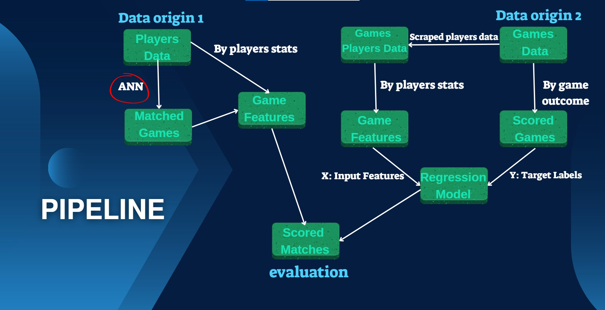

# ANN-Based Matchmaking System for Competitive Gaming

## Overview
The ANN-Based Matchmaking System for Competitive Gaming is a data-driven system designed to evaluate and improve team balancing in competitive online gaming, specifically for League of Legends. This project integrates advanced matchmaking algorithms, game score evaluation models, and performance analysis tools. The primary goal is to provide a fair matchmaking experience by leveraging machine learning and statistical analysis techniques.

## 🚀 Key Features

- **Approximate Nearest Neighbor (ANN) Algorithm**: Fast and efficient player selection.
- **Game Score Prediction**: Evaluates the quality of matches based on team balance.
- **Scalable Design**: Capable of handling large datasets for matchmaking.
- **Custom Metrics**: Metrics designed to ensure balanced and fair games.
- **Comprehensive Evaluation**: Supports feature selection, validation, and comparative analysis.

## Motivation

A strong matchmaking system is critical for maintaining player engagement in competitive gaming. Properly balanced games are more enjoyable, encouraging players to return frequently. This project addresses the challenge of forming balanced teams quickly while considering scalability and real-world constraints.

## 🛠️ Technologies Used

- **Programming Languages**: Python
- **Machine Learning Libraries**: Scikit-learn, XGBoost
- **Data Structures**: KD-Trees for efficient player retrieval
- **Visualization**: Matplotlib for result analysis
- **Data Processing**: Pandas and NumPy for handling player statistics and match data

## 📊 Core Components


### Matchmaking
- Uses an ANN-based clustering algorithm to group players into balanced teams
- Considers performance metrics such as:
  - Matchmaking Rating (MMR)
  - Win Rate
  - Games Played
  - Kills, Deaths, Assists (KDA)
  - Average Gold per Minute
  - Average Creep Score

### Game Analysis
- Predicts game balance score based on team lineup statistics
- Evaluates team variance and similarity metrics
- Generates graphs showing model quality and matchmaking performance

### Evaluation
- Compares ANN-based matchmaking outcomes with real match data
- Tests different ANN configurations and feature sets

## 📦 Installation

### Prerequisites
- Required libraries listed in `requirements.txt`

### Installation Steps
1. Clone the repository
    ```bash
    git clone https://github.com/oribar18/ANN_LOL_Matchmaking.git
    cd ANN_LOL_Matchmaking
    ```
2. Install dependencies
    ```bash
    pip install -r requirements.txt
    ```

##  Usage
### Running Main script
```bash
cd evaluation
python main_run.py
```


## 🤝 Contributing
Contributions are welcome! If you encounter any issues or have ideas for improvement, feel free to submit a pull request or open an issue.
1. Fork the repository
2. Create your feature branch (`git checkout -b feature/AmazingFeature`)
3. Commit your changes (`git commit -m 'Add some AmazingFeature'`)
4. Push to the branch (`git push origin feature/AmazingFeature`)
5. Open a Pull Request


## 📞 Contact
Project Maintainer - omernevo@campus.technion.ac.il

